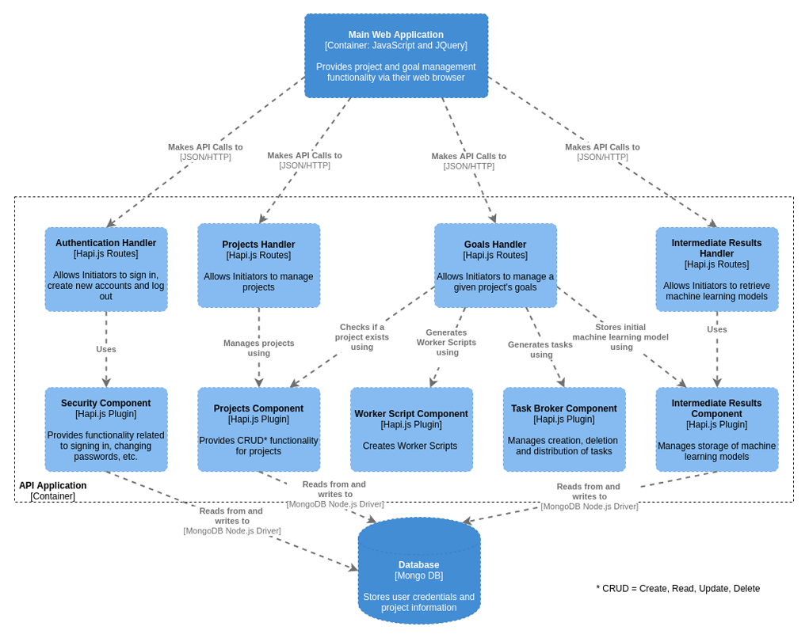

<!--
*** Thanks for checking out this README Template. If you have a suggestion that would
*** make this better, please fork the repo and create a pull request or simply open
*** an issue with the tag "enhancement".
*** Thanks again! Now go create something AMAZING! :D
-->


<!-- PROJECT SHIELDS -->
<!--
*** I'm using markdown "reference style" links for readability.
*** Reference links are enclosed in brackets [ ] instead of parentheses ( ).
*** See the bottom of this document for the declaration of the reference variables
*** for contributors-url, forks-url, etc. This is an optional, concise syntax you may use.
*** https://www.markdownguide.org/basic-syntax/#reference-style-links
-->
[![Contributors][contributors-shield]][contributors-url]
[![Forks][forks-shield]][forks-url]
[![Stargazers][stars-shield]][stars-url]
[![Issues][issues-shield]][issues-url]


<!-- PROJECT LOGO -->
<br />
<p align="center">
  <a href="https://github.com/JaviFigueroaRUM05/MLTogether/blob/develop/ml-together-frontend/images/LogoMLTRound.png">
    
  </a>

  <h3 align="center">ML-Together</h3>

  <p align="center">
    A Browser-Based Volunteer Computing System!
    <br />
    <a href="https://www.researchgate.net/publication/317487002_Lightweight_Volunteer_Computing_Platform_using_Web_Workers"><strong>Learn About Volunteer Computing»</strong></a>
    <br />
    <br />
    <a href="https://github.com/othneildrew/Best-README-Template">View Demo</a>
    ·
    <a href="https://github.com/JaviFigueroaRUM05/MLTogether/issues">Report Bug</a>
    ·
    <a href="https://github.com/othneildrew/Best-README-Template/issues">Documentation</a>
  </p>
</p>


<!-- TABLE OF CONTENTS -->
## Table of Contents

* [About the Project](#about-the-project)
  * [Built With](#built-with)
  * [Architecture](#architecture)
* [Getting Started](#getting-started)
  * [Prerequisites](#prerequisites)
  * [Installation](#installation)
* [Usage](#usage)
* [Roadmap](#roadmap)
* [Contributing](#contributing)
* [Contact](#contact)
* [Acknowledgements](#acknowledgements)


<!-- ABOUT THE PROJECT -->
## About The Project

[![Product Name Screen Shot][product-screenshot]](https://example.com)

MLTogether aims to provide developers a Browser-Based Volunteer Computing (BBVC) platform that is reliable and volunteer/developer friendly. The main idea is that researchers and/or programmers could request computational resources to train Machine Learning (ML) Models without additional software installation or complex technical knowledge.Since most dedicated grids and platforms for volunteer based distributed computing suffer from accessibility issues, there exists an opportunity to provide users computational resources through a BBVC system. Ideally, the user would be able to process data while benefiting from the ubiquity of browsers which, essentially, are available in most consumer electronic devices. 

### Built With

| Front-end                                     | Back-end                              |
| --------------------------------------------- | ------------------------------------- |
| [Angular](https://angular.io)                 | [MongoDB](https://www.mongodb.com)    |
| [HTML5](https://en.wikipedia.org/wiki/HTML5)  | [RabbitMQ](https://www.rabbitmq.com)  |
| [JQuery](https://jquery.com)                  | [Hapi.js](https://hapi.dev)           |
| [Bootstrap](https://getbootstrap.com)         | [Node.js](https://nodejs.org/en)      |

### Architecture



<!-- GETTING STARTED -->
## Getting Started

This is an example of how you may give instructions on setting up your project locally.
To get a local copy up and running follow these simple example steps.

### Prerequisites

This is an example of how to list things you need to use the software and how to install them.
* npm
```sh
npm install npm@latest -g
```

### Installation

1. Get a free API Key at [https://example.com](https://example.com)
2. Clone the repo
```sh
git clone https://github.com/your_username_/Project-Name.git
```
3. Install NPM packages
```sh
npm install
```
4. Enter your API in `config.js`
```JS
const API_KEY = 'ENTER YOUR API';
```


<!-- USAGE EXAMPLES -->
## Usage

Use this space to show useful examples of how a project can be used. Additional screenshots, code examples and demos work well in this space. You may also link to more resources.

_For more examples, please refer to the [Documentation](https://example.com)_


<!-- ROADMAP -->
## Roadmap

See the [open issues](https://github.com/othneildrew/Best-README-Template/issues) for a list of proposed features (and known issues).


<!-- CONTRIBUTING -->
## Contributors

This project was started as a required Capstone Experience for the CIIC-4151 course at the University of Puerto Rico at Mayaguez ([UPRM](https://www.uprm.edu/portada)). The participants will be listed below. It is important to notice that these only mark their primary role on the software development but it is in no way limited to their actual contribution.

| Name                | Primary Role                          |
| ------------------- | ------------------------------------- |
| Kelvin García       | Front-end Developer                   |
| Javier O. Figueroa  | Back-end Developer/System Architect   |
| Manuel A. Baez      | Back-end Developer/SCRUM Master       |
| Alejandra M. Ortiz  | Back-end Developer                    |
| Wilson Rivera       | Professor Mentor                      |


<!-- CONTACT -->
## Contact

Your Name - [@your_twitter](https://twitter.com/your_username) - email@example.com

Project Link: [https://github.com/your_username/repo_name](https://github.com/your_username/repo_name)


<!-- ACKNOWLEDGEMENTS -->
## Acknowledgements
* [Font Awesome](https://fontawesome.com)
* [Ace](https://ace.c9.io)


<!-- MARKDOWN LINKS & IMAGES -->
<!-- https://www.markdownguide.org/basic-syntax/#reference-style-links -->
[contributors-shield]: https://img.shields.io/github/contributors/JaviFigueroaRUM05/MLTogether.svg?style=flat-square
[contributors-url]: https://github.com/JaviFigueroaRUM05/MLTogether/graphs/contributors
[forks-shield]: https://img.shields.io/github/forks/JaviFigueroaRUM05/MLTogether.svg?style=flat-square
[forks-url]: https://github.com/JaviFigueroaRUM05/MLTogether/network/members
[stars-shield]: https://img.shields.io/github/stars/JaviFigueroaRUM05/MLTogether.svg?style=flat-square
[stars-url]: https://github.com/othneildrew/Best-README-Template/stargazers
[issues-shield]: https://img.shields.io/github/issues/JaviFigueroaRUM05/MLTogether.svg?style=flat-square
[issues-url]: https://github.com/JaviFigueroaRUM05/MLTogether/issues
[license-shield]: https://img.shields.io/github/license/othneildrew/Best-README-Template.svg?style=flat-square
[license-url]: https://github.com/othneildrew/Best-README-Template/blob/master/LICENSE.txt
[linkedin-shield]: https://img.shields.io/badge/-LinkedIn-black.svg?style=flat-square&logo=linkedin&colorB=555
[linkedin-url]: https://linkedin.com/in/othneildrew
[product-screenshot]: images/screenshot.png


